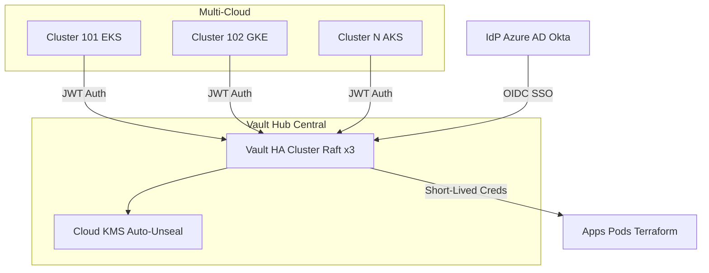
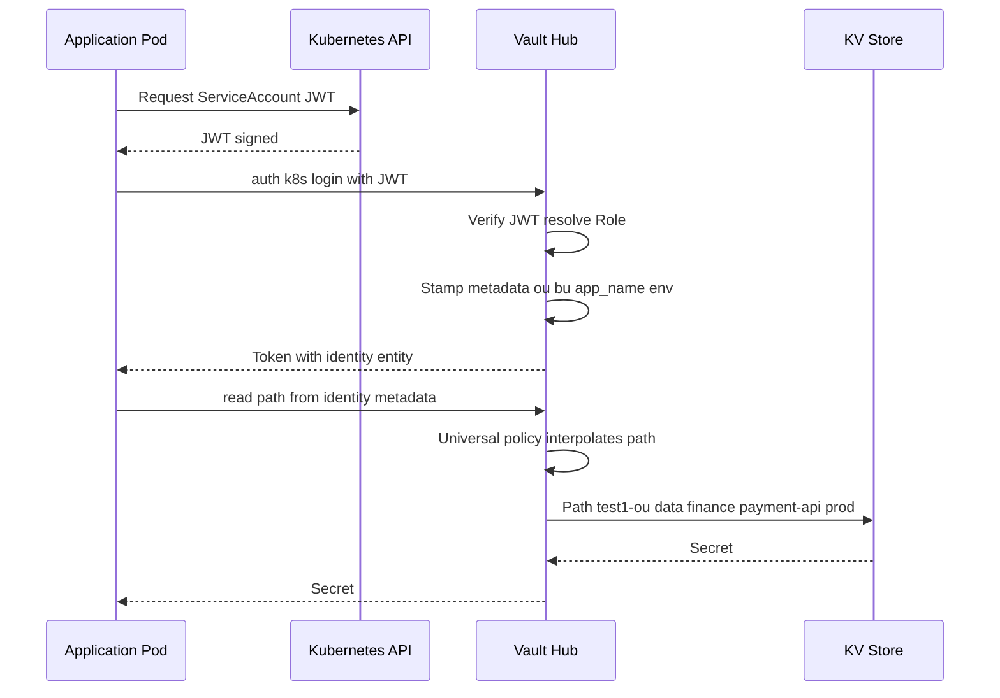
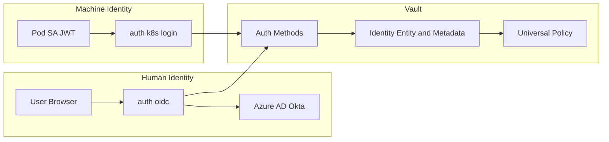
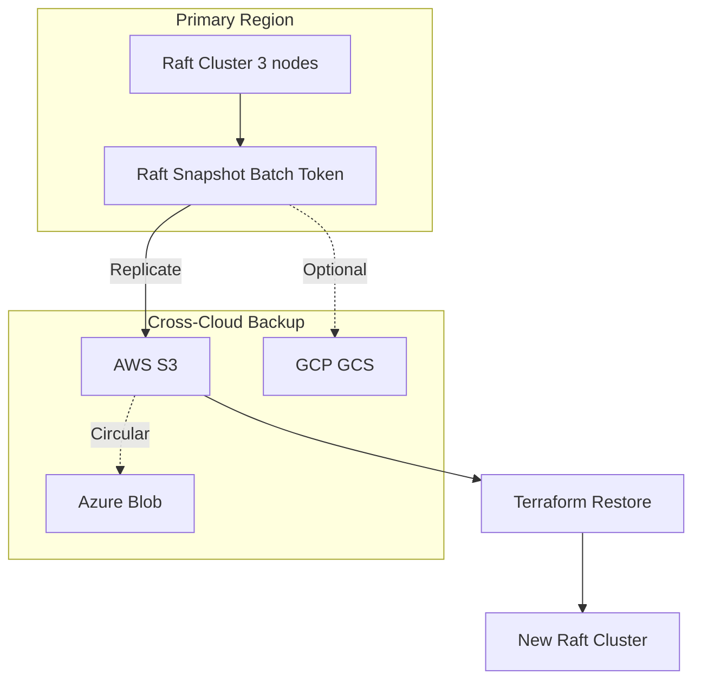
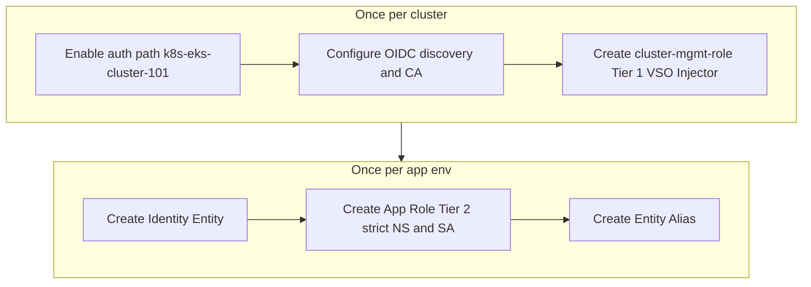

# Vault Hub — Architectural Specification

**Source of truth** for the Vault Hub: a centralized security broker for **multi-tenant Kubernetes clusters** and cloud accounts, designed according to Vault OSS best practices with **minimal policy sprawl**, **minimal infrastructure waste**, and a strong focus on **simplicity, performance, and availability**.

## Metadata dashboard

| Attribute | Value |
| --- | --- |
| **Owner / Lead** | @[Name] |
| **Service Status** | Alpha / Beta / Production |
| **Repository / Code** | `devtools-landingzone/addons/vault` |
| **Dependencies** | Vault OSS/Enterprise, Kubernetes (hub/spoke), Terraform (modules) |
| **Slack / Support** | #[Channel-Name] |

**Edition and scope:** This specification targets **Vault open-source (OSS)** unless otherwise noted. Identity entities, groups, and metadata-driven policy are available in OSS. **Vault Namespaces** (per-tenant isolation) and **native DR replication** (warm standby failover) are **Enterprise-only**; in OSS, multi-tenancy is enforced by path convention and strict policies, and DR is achieved via **automated Raft snapshots plus Terraform (or automation) to restore** to a new cluster. Any step or option that requires Vault Enterprise is explicitly labeled **Vault Enterprise only**. Do not assume Enterprise features without licensing.

---

## Table of Contents

1. [Overview & Design Philosophy](#1-overview--design-philosophy)
2. [Architecture](#2-architecture)
3. [Infrastructure Standards](#3-infrastructure-standards)
4. [Identity Metadata Standard](#4-identity-metadata-standard)
5. [Policy Specification](#5-policy-specification)
6. [Multi-Tenant Authentication](#6-multi-tenant-authentication) (§6.1.1: trust-domain mounts; §6.1.2: combined identification; §6.3: AppRole no secret_id; §6.3.1: cluster onboarding flow; §6.4: VM-based)
7. [Human Governance & SSO](#7-human-governance--sso)
8. [Disaster Recovery](#8-disaster-recovery)
9. [Standard Operating Procedures](#9-standard-operating-procedures)
10. [Security Guardrails & Reference](#10-security-guardrails--reference)

For a separate **brutal honest review** and score, see [BRUTAL-REVIEW.md](./BRUTAL-REVIEW.md).

---

## 1. Overview & Design Philosophy

The Vault Hub is a **centralized security broker** in a hub-and-spoke model, optimized for **multi-tenant Kubernetes platforms** (many teams and clusters sharing a single, well-governed Vault) with as little moving parts and duplication as possible. Three principles:

| Principle | Description |
|-----------|-------------|
| **Identity-First** | Every request is tied to a cryptographically verified Identity Entity. |
| **Policy Minimalism** | A single "Universal Policy" replaces hundreds of static policy files. |
| **Zero-Static Credentials** | No master keys or long-lived secrets for cloud or cluster access. |

---

## 2. Architecture

### 2.1 High-Level: Hub-and-Spoke



### 2.2 Identity & Policy Resolution Flow



**Note:** The sequence above describes the **JWT auth** path (pod presents SA JWT to Vault). When using the **AppRole + ClusterRole** pattern (recommended), the pod reads **role_id** from a Kubernetes Secret (access controlled by ClusterRole/RoleBinding) and performs `auth approle login` with role_id only; no JWT is sent to Vault. Policy and path resolution are the same (metadata-driven).

### 2.3 Authentication Flows (K8s + OIDC)



### 2.4 Disaster Recovery & Backup



### 2.5 Cluster & Application Onboarding Flow



**Note:** With **trust-domain mounts** (§6.1.1), "Enable auth path" is once per trust domain (e.g. `k8s-prod`, `k8s-nonprod`), not per cluster; cluster identity comes from role binding (`iss` in JWT or one AppRole per cluster with metadata).

---

## 3. Infrastructure Standards

### 3.1 High Availability (HA)

| Item | Standard |
|------|----------|
| **Backend** | HashiCorp Raft (integrated storage) |
| **Node count** | **Minimum 3** (quorum 2); for higher-scale or mission-critical deployments, **prefer 5 nodes** (quorum 3, tolerate 2 simultaneous failures), distributed across three Availability Zones. See [Raft reference architecture](https://developer.hashicorp.com/vault/tutorials/day-one-raft/raft-reference-architecture). |
| **Auto-unseal** | Cloud KMS (e.g. AWS KMS via IRSA) for zero-touch recovery after pod restarts or regional failover |
| **OSS standby behavior** | In OSS, standby nodes **do not serve read requests**; they forward traffic to the active leader. Read scaling via Performance Standby Nodes is **Vault Enterprise only**. The single active leader bears the full request load. |
| **Load balancer** | Route client traffic **only to the active leader**. Use Vault’s **`/sys/health`** endpoint: **200** = initialized, unsealed, active leader (route traffic); **429** = standby (exclude); **503** = sealed/unavailable (exclude); **501** = uninitialized (exclude). Configure the LB to treat only 200 as healthy so requests are not proxied through standby nodes. |

### 3.2 Resilience & Performance

| Item | Standard |
|------|----------|
| **Raft storage** | High-performance **gp3** SSDs with **minimum 10,000 IOPS and 250 MB/s sustained write** to avoid latency-induced Raft election timeouts. Under high write load (many tokens/leases), slow disk or saturated IO can cause followers to miss heartbeats and trigger leader elections, degrading availability. See [Vault with Integrated storage reference architecture](https://developer.hashicorp.com/vault/tutorials/day-one-raft/raft-reference-architecture#system-requirements). |
| **Audit** | **At least two audit devices of different types** (e.g. `file` to `stdout` for cluster log collector + `file` to a dedicated 50Gi PVC, or file + socket/syslog to SIEM). Vault blocks requests if it cannot write to at least one device; dual-path avoids single point of failure. Enable audit **immediately after cluster init** so all config and root token use is logged. |

### 3.3 Audit Logging Best Practices (HashiCorp Reference)

- **Enable at init:** Turn on at least one audit device right after initializing a new cluster; add a second device before production.
- **Remote forwarding:** Configure at least one device to forward logs to a remote system (SIEM, object storage) for long-term retention and analysis; deduplicate by `request.id` if aggregating multiple devices.
- **Common settings:** Set `hmac_accessor = false` so token accessors are readable in logs for revocation and incident response; set `elide_list_responses = true` to reduce log volume from list operations.
- **Audit log rotation:** Rotate and archive audit logs (e.g. **logrotate** with **HUP** signal) so disks do not fill; Vault halts operations if it cannot write to an audit device. Log maintenance is critical to avoid service interruption.
- **Monitoring:** Alert on audit device health (e.g. `vault.audit.log_response_failure`, `log_request_failure`), disk space for file devices, and suspicious activity (auth failures, permission denied spikes, root token use). Scrape Vault **`/sys/metrics`** (Prometheus format) for request rate, errors, auth failures, and Raft commit times as part of health checks; see [Telemetry](https://developer.hashicorp.com/vault/docs/internals/telemetry) and [Monitor telemetry with Prometheus & Grafana](https://developer.hashicorp.com/vault/tutorials/monitoring/monitor-telemetry-grafana-prometheus).
- **Reference:** [Vault audit best practices](https://developer.hashicorp.com/vault/docs/audit/best-practices).
- **Scale and fault tolerance:** A central Vault cluster in one region is a single point of failure for that region; plan for regional failure (snapshots to cross-region/cross-cloud storage, documented restore). **Vault Enterprise only:** DR replication provides warm standby. As the number of clusters and clients increases, the single active leader (OSS) bears full load—monitor latency and errors, use batch tokens to reduce Raft churn, and plan for latency spikes at peak. In OSS, standby nodes do **not** serve read requests (Performance Standby is Enterprise-only); scale the leader’s resources and IOPS. See [Vault limits](https://developer.hashicorp.com/vault/docs/internals/limits).

---

## 4. Identity Metadata Standard

Security logic is driven by **identity metadata**. After authentication, Vault stamps the client (pod or user) with four mandatory tags and an optional **cluster claim**:

| Metadata Key | Description | Example |
|--------------|-------------|---------|
| `ou` | Organizational unit (top-level mount) | `test1` |
| `bu` | Business unit (L2 folder) | `finance` |
| `app_name` | Unique application ID | `payment-api` |
| `env` | Deployment lifecycle | `prod` |
| `cluster` | **Cluster claim** (recommended): cluster identifier for the Kubernetes cluster that issued the JWT. Set on the auth role at cluster onboarding; used for audit, path conventions, or multi-cluster policy. | `eks-cluster-101` |

Path layout: `{{ou}}-ou/data/{{bu}}/{{app_name}}/{{env}}/*`

**Multi-tenant model:** Each app has its own path in Vault. In **OSS**, isolation is by path and policy only. With **Vault Enterprise**, a tenant or app can use a dedicated **Vault Namespace** for hard isolation. Paths are keyed by identity metadata (`ou`, `bu`, `app_name`, `env`); policy restricts each identity to its own path so apps cannot access other tenants’ or other apps’ secrets. Use **KV secrets engine version 2** for all `*-ou` mounts (metadata API and versioning).

The **cluster** value is set when the cluster is onboarded (see §6.3); it is not supplied by the workload and cannot be overridden by the client. All dimensions above are used for **combined identification via metadata** (see §6.1.2): policy and paths key off this metadata regardless of auth mount layout. **Identity:** Policy interpolation of `identity.entity.metadata.*` requires the **Identity secrets engine** (entities, aliases, groups), which is available in **open-source Vault**. **Limits:** Entities support up to **64** metadata key-value pairs per entity (key ≤128 bytes, value ≤512 bytes). **Total entity count** is bounded by Raft storage and operational limits; monitor **`vault.identity.num_entities`** and stay within [Vault limits](https://developer.hashicorp.com/vault/docs/internals/limits). Plan for tenant consolidation or **Vault Enterprise Namespaces** if entity growth exceeds comfortable bounds. **Bootstrap ordering:** Provision entity, alias, and metadata **before** deploying the application workload; otherwise the first login can create an entity with no metadata (universal policy interpolates null → 403) and Terraform can later fail with “entity alias already exists.” See §9.2 and §9.3.

---

## 5. Policy Specification

### 5.1 Universal Policy (Single Dynamic Template)

One policy covers the vast majority of applications. Paths are derived from the requester’s identity metadata.

**File: `universal-nested-policy.hcl`**

```hcl
# 1. Application-specific KV path
path "{{identity.entity.metadata.ou}}-ou/data/{{identity.entity.metadata.bu}}/{{identity.entity.metadata.app_name}}/{{identity.entity.metadata.env}}/*" {
  capabilities = ["read", "list"]
}

# 2. Shared/common secrets for the BU+env
path "{{identity.entity.metadata.ou}}-ou/data/{{identity.entity.metadata.bu}}/shared/{{identity.entity.metadata.env}}/*" {
  capabilities = ["read", "list"]
}

# 3. Self-discovery: read own entity metadata
path "identity/entity/id/{{identity.entity.id}}" {
  capabilities = ["read"]
}
```

**Apply once (no per-app policy files):**

```bash
vault policy write universal-nested-policy universal-nested-policy.hcl
```

**Resolution example:** Role metadata `ou=test1`, `bu=finance`, `app_name=payment-api`, `env=prod` → allowed path `test1-ou/data/finance/payment-api/prod/*`. Access to `test1-ou/data/retail/oms/prod/*` is denied.

Isolation: metadata is set on the **auth role** at onboarding; an app cannot change it to access another team’s path.

### 5.2 Break-Glass: Hub Operator Policy

For SREs who manage auth mounts and identity (not secret data):

**File: `hub-operator-policy.hcl`**

```hcl
# Auth methods (cluster onboarding; include approle if using AppRole mounts)
path "sys/auth/k8s-*" {
  capabilities = ["create", "read", "update", "delete", "sudo"]
}
path "sys/auth/approle-*" {
  capabilities = ["create", "read", "update", "delete", "sudo"]
}

# Identity: aliases only (do NOT grant full identity/* — SREs must not be able to update entity/group metadata and impersonate tenants)
path "identity/entity-alias/*" {
  capabilities = ["create", "read", "update", "delete"]
}
path "identity/group-alias/*" {
  capabilities = ["create", "read", "update", "delete"]
}

# KV mount metadata only (no secret data read)
path "*-ou/metadata/*" {
  capabilities = ["list", "read"]
}
# Explicit: no read on secret data paths
# path "*-ou/data/*" is not granted; hub operators cannot read tenant secret values
```

**Note:** Creating new **entities** and **groups** (e.g. for app onboarding) requires a separate policy or break-glass; hub-operator must not have `identity/entity/*` or `identity/group/*` update/delete, or they could rewrite any app’s metadata (e.g. `ou=their-tenant`) and access that tenant’s secrets.

---

## 6. Multi-Tenant Authentication

**Recommended machine auth (Kubernetes):** Two patterns are documented: **(1) Native Kubernetes auth or JWT auth** — workload presents a ServiceAccount JWT; Vault (or the cluster’s TokenReview/JWT validation) verifies it cryptographically; no role_id/secret_id. **(2) AppRole with no secret_id** — workload reads **role_id** from a Kubernetes Secret (RBAC-controlled) and logs in with `auth/approle/login`; trust boundary is “who can read the Secret.” Some architectural assessments treat **bind_secret_id=false** as single-factor (role_id is a static credential) and recommend **native Kubernetes auth** as primary for K8s; use **AppRole with secret_id + response wrapping** for VMs or non-K8s. This spec documents both; choose based on risk tolerance and operational constraints. See §6.3 and §9.

### 6.1 Tiered Kubernetes Authentication

| Tier | Purpose | Binding | Use case |
|------|---------|---------|----------|
| **Management (Tier 1)** | VSO / Injector | Wildcard namespaces `*:*`, infrastructure metadata | Cluster-wide operator |
| **Application (Tier 2)** | Microservices | Exact `Namespace` + `ServiceAccount` | Per-app least privilege |

### 6.1.1 Trust-Domain Mount Model (Multi-Cloud Grouping)

Group by **trust domain** instead of one mount per cluster. Use a small set of mounts; bind **issuer (`iss`)** and **service account (`sub`)** inside each role so Vault still knows exactly which cluster issued the token.

| Auth Mount | Used By |
|-------------|---------|
| `auth/k8s-prod` | Production clusters across clouds (EKS, AKS, GKE) |
| `auth/k8s-nonprod` | Dev/stage clusters |
| `auth/k8s-platform` | Platform tooling clusters |

**Example — EKS cluster:**

```bash
vault write auth/k8s-prod/role/payment-api \
  role_type="jwt" \
  bound_claims='{
    "iss": "https://oidc.eks.us-east-1.amazonaws.com/id/AAA",
    "sub": "system:serviceaccount:finance-prod:payment-api-sa"
  }'
```

**Example — AKS cluster (same app, different cloud):**

```bash
vault write auth/k8s-prod/role/payment-api-aks \
  role_type="jwt" \
  bound_claims='{
    "iss": "https://oidc.prod-aks.azure.com/XYZ",
    "sub": "system:serviceaccount:finance-prod:payment-api-sa"
  }'
```

The **issuer (`iss`)** uniquely identifies the cluster; no need for a separate mount per cluster.

### 6.1.2 Combined Identification via Metadata

Identification is **combined in token metadata** (see §4). Set **`ou`**, **`bu`**, **`env`**, **`cluster`**, **`app_name`** (and any other dimensions) on each auth role at onboarding. Policy and path layout key off this metadata (e.g. `secret/data/{{identity.entity.metadata.bu}}/{{identity.entity.metadata.app_name}}/...`). Mounts stay **trust-domain based** (prod / nonprod / platform); there is no need to structure mounts by BU/OU. This keeps a single identity schema for humans, Kubernetes workloads, and VMs while allowing BU/OU-focused access and audit.

### 6.2 Keyless Multi-Cloud Federation

- Vault uses **Workload Identity Federation (WIF)** and OIDC to identify itself to AWS/Azure/GCP (no static IAM keys).
- It issues **short-lived dynamic credentials** (STS tokens / service principals) for Terraform or other provisioning.

### 6.3 Design Discussion: Cluster Claim in Metadata and AppRole with No secret_id

**Requirements:**

1. **Cluster claim in metadata** – Add a cluster identifier (e.g. `cluster=eks-cluster-101`) to the identity metadata so every token from that cluster carries the cluster identity. Set once at **cluster onboarding** on the Vault auth role; not supplied by the workload. Use for audit, path conventions, or multi-cluster policy.
2. **AppRole with no secret_id** – Use the Vault **AppRole** auth method for machine identity, but **do not use secret_id**. (Pod uses **role_id** from a Secret and `auth/approle/login`; no JWT. See AppRole flow below.) Set **`bind_secret_id = false`** so login requires only **role_id**. **Offload authentication to the cluster**: the cluster is onboarded via the cluster’s **OIDC** (JWT issuer); which workloads can log in is determined by **Kubernetes RBAC** (e.g. **ClusterRole** + RoleBinding). The pod presents only its **ServiceAccount JWT**; Vault validates the JWT against the cluster’s OIDC and the role’s bound claims (e.g. `sub` = SA). No second credential (secret_id).

**AppRole flow (no JWT):** The pod reads **role_id** from a Kubernetes Secret (RBAC-controlled) and calls **`auth/approle/login` with `role_id=<UUID>`**; no ServiceAccount JWT is sent to Vault. For the JWT path, the pod presents an SA JWT and Vault validates `bound_claims` (`iss`, `sub`).

**Feasibility: yes.**

- **Cluster claim:** When you create the AppRole role at cluster onboarding, set token metadata to include `cluster=eks-cluster-101`. Every token issued for that role then carries `cluster` in its identity metadata.
- **AppRole, bind_secret_id=false:** Use AppRole with `bind_secret_id=false` so the client logs in with only `role_id`. Store the role_id in a Kubernetes Secret readable only by ServiceAccounts that have a **ClusterRole** (e.g. `vault-approle-finance-prod`). Who can log in is constrained by **who can read the role_id**: use RoleBinding to bind that ClusterRole to the allowed SAs. Only those pods can read the role_id and log in with role_id only. Authentication is offloaded to cluster RBAC and OIDC.

**Summary:** Add **cluster** to metadata at cluster onboarding. Use **AppRole** for machines with **no secret_id** (`bind_secret_id=false`); authentication is offloaded to the cluster’s OIDC and Kubernetes ClusterRole/RoleBinding. Feasible.

**Token lifetime (AppRole):** Prefer **short token TTL** (e.g. 1h) and **Vault Agent** for auto-renewal and secret injection (clients must renew before expiry to avoid disruption; Vault Agent handles this in the background). For very high auth throughput (1000s/sec), consider **batch tokens** to reduce Raft churn. See [AppRole best practices](https://developer.hashicorp.com/vault/docs/auth/approle/approle-pattern).

**role_id as credential:** With `bind_secret_id=false`, the **role_id** is effectively a **static credential**—treat it like a secret. Restrict who can read it (Kubernetes RBAC). **Rotate RoleIDs periodically** (e.g. quarterly or on schedule) and **immediately if compromised**: create a new AppRole (new role_id), update the Kubernetes Secret, re-run the entity/alias bootstrap (§9.3 step 4), then remove or disable the old AppRole. Short token TTL limits blast radius. Where feasible, use **token_bound_cidrs** or **secret_id_bound_cidrs** (when using secret_id) to restrict source IPs or CIDRs and reduce exposure.

### 6.3.1 Cluster Onboarding and Application Binding (AppRole + ClusterRole Flow)

1. **Onboard cluster (OIDC):** Establish cluster identity in Vault (e.g. configure OIDC discovery for the cluster issuer). Optionally enable a JWT auth mount or record the cluster id for audit. No AppRole yet.
2. **Define ClusterRole (Kubernetes):** Create a ClusterRole that grants **read** on the Secret(s) containing Vault **role_id**. This is the reference: "whoever has this ClusterRole can read a role_id and thus authenticate to Vault."
3. **Per-application AppRole:** For each app, create a Vault AppRole (one per app, or per app per cluster) with metadata `cluster`, `bu`, `ou`, `app_name`, `env` and policy (e.g. universal-nested-policy). Store that AppRole's **role_id** in a Kubernetes Secret (e.g. in the app's namespace, or a central namespace with strict RBAC).
4. **Bind to namespace + SA:** Use a **RoleBinding** so that **only** that app's **namespace** and **ServiceAccount** have the ClusterRole (or a role that can read that Secret). Only that SA can read the role_id and perform `auth approle login` with role_id only.

Result: cluster identity from OIDC and from AppRole metadata; each app has its own AppRole and path; binding is namespace + SA via Kubernetes RBAC.

### 6.4 VM-Based Workloads (Non-Kubernetes)

Kubernetes workloads use AppRole with no secret_id and ClusterRole/OIDC to control who gets the role_id. **VM-based** workloads (bare metal, EC2, Azure VMs, GCP VMs, or any host without a Kubernetes ServiceAccount) need a different strategy because they do not have cluster OIDC or ClusterRole.

**Quick choice:** Cloud VM → cloud auth (aws/azure/gcp); on-prem or non-cloud VM → AppRole with secret_id (use **response wrapping** for SecretID delivery) or cert auth.

| Approach | Description | Pros / Cons |
|----------|-------------|-------------|
| **Cloud auth (AWS / Azure / GCP)** | Use Vault's **aws**, **azure**, or **gcp** auth method. The VM uses its **instance identity** (e.g. AWS instance metadata, Azure MSI, GCP metadata) to prove it is that VM; no long-lived secret_id. | No secret_id; cloud attests the VM. Requires Vault to trust the cloud account/tenant and to configure the auth mount (role bound to IAM role / MSI / service account). |
| **AppRole with secret_id** | Use AppRole with **bind_secret_id = true**. VMs receive role_id + secret_id (or a **wrapped** secret_id for one-time unwrap). Optionally **bound_cidr_list** to restrict by VM IP. | Works for any VM (on-prem or cloud). secret_id is a second credential; use response wrapping and short TTL, or automate rotation, to limit exposure. |
| **Cert auth** | VMs are issued a **client certificate**; Vault **cert** auth validates the cert. CA and issuance are managed outside Vault (e.g. internal PKI). | No role_id/secret_id; cert is the credential. Requires PKI and cert distribution/rotation on VMs. |
| **OIDC (machine)** | If VMs can obtain an OIDC token (e.g. from a cloud provider or a small agent that does device/machine OIDC), use Vault **jwt** or **oidc** auth with that issuer. | Keyless from Vault's perspective if the IdP attests the machine. Depends on VM having an OIDC-capable identity. |

**Recommendation:**

- **Cloud VMs (EC2, Azure VM, GCE):** Prefer **cloud auth** (aws / azure / gcp) so the VM uses instance identity only; no secret_id. Onboard each account/subscription/project (or use a single mount per cloud) and create roles bound to IAM role / MSI / service account. Stamp **metadata** (e.g. `cluster=vm-aws-account-123` or `platform=vm-azure-prod`) on the role so VM tokens carry a claim analogous to cluster claim; the same **universal policy** can then key off `ou`, `bu`, `app_name`, `env` and optionally `cluster`/`platform` for path resolution.
- **On-prem or non-cloud VMs:** Use **AppRole with secret_id** with tight controls: **response wrapping** (`-wrap-ttl`) for SecretID delivery so only the target system can unwrap; **secret_id_num_uses=1** where feasible; **secret_id_bound_cidrs** to restrict source IPs; short **secret_id_ttl** and automation to rotate. Alternatively use **cert auth** if you have PKI. See [AppRole best practices](https://developer.hashicorp.com/vault/docs/auth/approle/approle-pattern). Stamp **metadata** (e.g. `cluster=vm-datacenter-dc1`, `platform=vm`) on the AppRole so VM tokens are distinguishable and the universal policy still applies.
- **Unified metadata:** Use the same metadata schema (`ou`, `bu`, `app_name`, `env`, and a **cluster** or **platform** claim) for both Kubernetes and VM roles so path resolution and audit are consistent; only the auth method and credential shape differ (K8s: role_id only + ClusterRole; VM: cloud identity or role_id+secret_id or cert).

**Summary:** Kubernetes: AppRole with no secret_id + ClusterRole/OIDC. VMs: use **cloud auth** where the VM runs (no secret_id), or **AppRole with secret_id** (or cert auth) for on-prem/non-cloud VMs, with strict binding and metadata (cluster/platform) so the same policy and audit model apply.

---

## 7. Human Governance & SSO

### 7.1 OIDC Flow

1. User chooses “Login with OIDC” in the Vault UI.
2. Redirect to company IdP (e.g. Azure AD).
3. IdP returns a JWT (email + group memberships).
4. Vault maps SSO groups to **internal Vault groups** (with metadata).

### 7.2 Group Standard

- **Access method:** OIDC only; no local Vault users.
- **Grouping:** Humans mapped via **external identity groups** (group alias from IdP group ID to Vault group).
- **Metadata:** Groups carry `ou`, `bu`, `env` so the same **universal policy** applies to humans and apps (symmetric access).

**Create a team group and alias (example):**

```bash
GROUP_ID=$(vault write -format=json identity/group name="finance-developers" \
    type="internal" \
    metadata="ou=test1,bu=finance,env=prod" \
    policies="universal-nested-policy" \
    | jq -r '.data.id')

vault write identity/group-alias name="{{SSO_GROUP_OBJECT_ID}}" \
    mount_accessor=$(vault auth list -format=json | jq -r '."oidc/".accessor') \
    canonical_id=$GROUP_ID
```

### 7.3 SRE Break-Glass Group

```bash
vault write identity/group name="vault-admins" \
    type="internal" \
    policies="hub-operator-policy" \
    metadata="ou=system,bu=sre"
```

For vault-admin and break-glass accounts, consider **Vault 1.9+** safeguards: **user lockout** on repeated failed logins (AppRole, userpass, LDAP) and **MFA** (e.g. Okta, Duo) for critical users to reduce risk of credential abuse.

---

## 8. Disaster Recovery

| Metric | Target |
|--------|--------|
| **RPO** | 15 minutes (high-frequency automated snapshots; **do not rely on manual** snapshots). |
| **RTO** | Target &lt; 30 minutes; **in practice**, restoring multi-GB snapshots can take **hours** (see below). |
| **Snapshot** | **Automated** via CronJob or pipeline: authenticate, run `vault operator raft snapshot save`, stream output to immutable object storage (S3/GCS). Capture **`raft_applied_index`** in snapshot metadata. Batch tokens reduce Raft churn. |
| **Replication** | Snapshots to an **immutable** bucket (versioning or object lock). |
| **Testing** | **Schedule periodic DR drills** and operational monitoring: restore to a new cluster to validate RTO; alert on snapshot age and restore pipeline health. |
| **Scale** | 150+ clusters imply large state; snapshots can reach **multi-GB**. |
| **Enterprise** | **Vault Enterprise only:** DR replication provides warm standby; OSS has no native replication. |

**Snapshot restore tuning (large snapshots):** Restoring multi-GB snapshots often fails with timeouts or “request body could not be read” if defaults are used. **Before restore:** (1) Increase **VAULT_CLIENT_TIMEOUT** (e.g. 3600s) on the client. (2) On the Vault server listener: increase **max_request_duration** (e.g. 3600s) and set **max_request_size = -1** (or sufficiently large) so the snapshot payload can be ingested. (3) Ensure the target node has **sufficient RAM** for decompression (memory spikes during restore). See [Restore a Vault snapshot](https://developer.hashicorp.com/vault/docs/commands/operator/raft/snapshot-restore) and [Vault limits](https://developer.hashicorp.com/vault/docs/internals/limits). Ephemeral secrets and leases created after the last snapshot are lost; applications must re-authenticate and re-request credentials after restore.

---

## 9. Standard Operating Procedures

**Paths:** Use **JWT auth** (§9.1–9.2) when workloads present a ServiceAccount JWT; use **AppRole** (§9.3) when using role_id-only with ClusterRole/RBAC. **Critical gotchas:** (1) Entity and entity-alias must be created **before** the app’s first login, or the first login creates an entity with no metadata and universal policy fails. (2) With AppRole and `bind_secret_id=false`, the **role_id** is a static secret—rotate it periodically and restrict read access. (3) Use short token TTL and Vault Agent for renewal so apps do not hold expired tokens.

### 9.1 Onboarding a New Kubernetes Cluster (Trust-Domain Mount)

Use **one auth mount per trust domain** (e.g. `k8s-prod`), not per cluster. Add **roles per cluster** with `bound_claims` (`iss`, `sub`) so Vault still knows which cluster issued the token. This matches §6.1.1 and avoids mount explosion (150 clusters → 150 mounts).

**1. Enable auth path once per trust domain** (e.g. production):

```bash
vault auth enable -path=k8s-prod jwt
```

**2. Configure trust (OIDC discovery + CA)** for the mount. If multiple clusters share the same OIDC provider type, you may configure once; roles will bind specific `iss` per cluster:

```bash
vault write auth/k8s-prod/config \
    oidc_discovery_url="https://oidc.eks.us-east-1.amazonaws.com/id/EXAMPLEDATA" \
    kubernetes_ca_cert=@ca.crt
```

**3. Create cluster management role (Tier 1) per cluster** — same mount, role name identifies the cluster; `bound_claims` with **iss** (cluster issuer) and **sub** (e.g. wildcard for mgmt):

```bash
vault write auth/k8s-prod/role/eks-cluster-101-mgmt \
    role_type="jwt" \
    bound_claims='{"iss": "https://oidc.eks.us-east-1.amazonaws.com/id/EXAMPLEDATA", "sub": "system:serviceaccount:*:*"}' \
    user_claim="sub" \
    metadata="ou=test1,bu=infrastructure,app_name=cluster-101-mgmt,cluster=eks-cluster-101" \
    token_policies="universal-nested-policy" \
    token_ttl="24h"
```

Repeat step 3 for each new cluster (new role, same mount). For AppRole-based cluster/application auth, see §9.3.

### 9.2 Onboarding an Application (JWT Auth, Trust-Domain Mount)

Uses the same **trust-domain mount** as §9.1 (e.g. `k8s-prod`). One role per app (or per app per cluster), with **bound_claims** including **iss** (cluster) and **sub** (service account).

**1. Create identity entity:**

```bash
ENTITY_ID=$(vault write -format=json identity/entity name="payment-api" \
    metadata="app_name=payment-api" \
    | jq -r '.data.id')
```

**2. Create application role (Tier 2)** under the trust-domain mount; bind **iss** (cluster OIDC issuer) and **sub** (SA). JWT roles must include **user_claim="sub"** and **bound_audiences** (if SA token has `aud`); set **bound_claims** to match issuer and service account per [Vault Kubernetes auth examples](https://developer.hashicorp.com/vault/docs/auth/jwt/oidc-providers/kubernetes):

```bash
vault write auth/k8s-prod/role/payment-api-prod \
    role_type="jwt" \
    user_claim="sub" \
    bound_audiences="vault" \
    bound_claims='{"iss": "https://oidc.eks.us-east-1.amazonaws.com/id/EXAMPLEDATA", "sub": "system:serviceaccount:finance-prod:payment-api-sa"}' \
    metadata="ou=test1,bu=finance,app_name=payment-api,env=prod,cluster=eks-cluster-101" \
    token_policies="universal-nested-policy" \
    token_ttl="1h"
```

**3. Create entity alias** (mount_accessor for the trust-domain mount, e.g. `k8s-prod`):

```bash
vault write identity/entity-alias name="system:serviceaccount:finance-prod:payment-api-sa" \
    canonical_id=$ENTITY_ID \
    mount_accessor=$(vault auth list -format=json | jq -r '."k8s-prod/".accessor')
```

### 9.3 Onboarding an Application (AppRole + ClusterRole)

Use this flow when the **AppRole (no secret_id) + ClusterRole** pattern is used (see §6.3.1). Prerequisite: cluster identity established (OIDC); AppRole auth mount enabled (e.g. `auth/approle-prod`).

**1. Create the AppRole in Vault** (one per app or per app per cluster). Metadata (ou, bu, app_name, env, cluster) is attached via identity entity + alias in step 4 so issued tokens carry it for path resolution.

```bash
vault write auth/approle-prod/role/payment-api-prod \
    bind_secret_id=false \
    token_policies="universal-nested-policy" \
    token_ttl="1h" \
    token_max_ttl="4h" \
    token_period="20m"
```

**2. Read the role_id and store it in a Kubernetes Secret** (in the app’s namespace):

```bash
ROLE_ID=$(vault read -format=json auth/approle-prod/role/payment-api-prod/role-id | jq -r '.data.role_id')
kubectl create secret generic vault-role-id-payment-api -n finance-prod \
    --from-literal=role_id="$ROLE_ID"
```

**3. Create a Role (namespaced) that allows the app’s ServiceAccount to read only this Secret:**

```yaml
# role-vault-approle-payment-api.yaml (apply in namespace finance-prod)
apiVersion: rbac.authorization.k8s.io/v1
kind: Role
metadata:
  name: vault-approle-payment-api
  namespace: finance-prod
rules:
  - apiGroups: [""]
    resources: ["secrets"]
    resourceNames: ["vault-role-id-payment-api"]
    verbs: ["get"]
---
apiVersion: rbac.authorization.k8s.io/v1
kind: RoleBinding
metadata:
  name: vault-approle-payment-api
  namespace: finance-prod
roleRef:
  apiGroup: rbac.authorization.k8s.io
  kind: Role
  name: vault-approle-payment-api
subjects:
  - kind: ServiceAccount
    name: payment-api-sa
    namespace: finance-prod
```

**4. Bootstrap entity and alias (one-time, from secure context)** so tokens from this AppRole carry metadata for path resolution. Use the AppRole mount’s accessor for the alias.

```bash
# 4a. First login with role_id (from secure bootstrap context); Vault creates entity
LOGIN_RESPONSE=$(vault write -format=json auth/approle-prod/login role_id="$ROLE_ID")
ENTITY_ID=$(echo "$LOGIN_RESPONSE" | jq -r '.auth.entity_id')

# 4b. Set metadata on that entity so universal policy path resolution works
vault write identity/entity/id/"$ENTITY_ID" \
    metadata="ou=test1,bu=finance,app_name=payment-api,env=prod,cluster=eks-cluster-101"

# 4c. Create alias so future logins with this role_id attach to this entity
vault write identity/entity-alias name="$ROLE_ID" \
    canonical_id="$ENTITY_ID" \
    mount_accessor=$(vault auth list -format=json | jq -r '."approle-prod/".accessor')
```

AppRole login creates a new entity per login **unless** an entity alias already exists for that role_id. So the alias must be created **after** the first login, using the entity from that login. Run 4a–4c once per app role (during onboarding). After that, every pod login with this role_id will use this entity and its metadata; without this bootstrap, each login would create an entity with no metadata and universal policy would fail (`identity.entity.metadata.*` empty).

Result: only the pod running as `payment-api-sa` in `finance-prod` can read the Secret and thus obtain the role_id to log in to Vault; binding is namespace + ServiceAccount. Tokens carry entity metadata for universal policy path resolution.

**Vault Agent (mandatory for production):** Use [Vault Agent](https://developer.hashicorp.com/vault/docs/agent-and-proxy/agent) as a sidecar or init container to authenticate (with role_id), renew tokens (including `token_period`), and inject secrets into the app. This avoids custom login/renewal code and aligns with HashiCorp’s recommended pattern for Kubernetes; production workloads should not implement raw Vault login/renew in application code.

---

## 10. Security Guardrails & Reference

### 10.1 Guardrails

- **Metadata immutability:** Metadata is defined at the **auth role** (or group) level; only Vault admins can change it, so apps cannot “hop” to another team’s path.
- **Path convention:** Every KV mount name must end with `-ou` (e.g. `test1-ou`) to align with the universal policy.
- **JWT auth (Vault 1.17+):** If the Kubernetes SA token includes an `aud` claim, the role's **bound_audiences** must match at least one value in `aud`; otherwise login can fail. **Always set `bound_audiences`** (and/or `bound_claims`) when configuring JWT roles for Kubernetes so login is constrained; do not rely on unbound JWT roles.
- **JWT vs Kubernetes auth method:** **Kubernetes auth** uses the cluster's TokenReview API (immediate revocation when SA/pod is deleted). **JWT auth** validates the token locally (no TokenReview); revoked tokens remain valid until expiry—use short-lived SA tokens or prefer Kubernetes auth if revocation is critical. See [Use Kubernetes for OIDC authentication](https://developer.hashicorp.com/vault/docs/auth/jwt/oidc-providers/kubernetes).
- **Root token and recovery:** Revoke the root token after init; use ACL policies and break-glass groups for elevated access. Initialization (Shamir unseal or auto-unseal), recovery keys, and root token handling must follow secure procedures—see [Vault Day 1 operations](https://developer.hashicorp.com/vault/docs/concepts/seal#day-one-operations) and handle recovery keys and root with appropriate guard duties and storage.
- **Network and trust boundaries:** Bind Vault’s API to internal networks only; do not expose the Vault listener to the public internet. Where possible, use **mTLS** or private connectivity for Vault–cluster and Vault–client communication to restrict and attest callers.
- **VM SecretIDs:** For VMs using AppRole with secret_id, **always use response wrapping** (`-wrap-ttl`) for SecretID delivery so only the target system can unwrap; see §6.4.
- **Audit log rotation:** Rotate audit device logs (e.g. logrotate + HUP) so storage does not exhaust; Vault halts requests if it cannot write to an audit device. See §3.3.
- **Kubernetes auth (native method):** If using the native **Kubernetes auth method** (not JWT) with in-cluster Vault, consider **disable_local_ca_jwt** and short-lived K8s tokens per Vault 1.9+ recommendations.

### 10.1.1 Prioritized Operational Checklist

- **OSS scope:** Do not use Namespaces or DR replication unless licensed for Vault Enterprise; label any Enterprise-only step.
- **AppRole role_id:** Treat as a secret; **rotate periodically** (e.g. quarterly) or if compromised (new AppRole → update Secret → re-bootstrap entity/alias → disable old role). Use token_bound_cidrs or secret_id_bound_cidrs where feasible.
- **Vault Agent:** Use for production pods (auto-auth, token renewal, secret injection); avoid raw login/renew in app code.
- **Audit log rotation:** Rotate/archive audit logs (logrotate + HUP) to prevent disk fill and service halt.
- **DR drills:** Schedule periodic restores from snapshots to verify RTO &lt; 30m; store backups in immutable storage (versioning or object lock).
- **JWT/K8s auth config:** JWT roles must set **user_claim="sub"**, **bound_audiences** (if SA token has `aud`), and **bound_claims** (iss, sub); native K8s auth: consider disable_local_ca_jwt for short-lived tokens.
- **Path-based multi-tenancy (OSS):** All policy and auth changes via **IaC** (Terraform); **CI/CD policy linting** to reject wildcards that overlap tenant paths; monitor entity count (`vault.identity.num_entities`) and noisy-neighbor impact.

### 10.2 Onboarding Summary

| Component | Level | Frequency | Purpose |
|-----------|--------|-----------|---------|
| Auth mount | Cluster | Once per cluster | Infrastructure trust |
| Cluster role | Cluster | Once per cluster | Management (VSO/Injector) |
| App role | App | Once per app/env | Least-privilege app access |
| Entity alias | App | Once per cluster | Identity continuity |

### 10.3 Human Access Summary

| Feature | Standard |
|---------|----------|
| Auth type | OIDC (SSO) |
| Identity entity | Created on first login |
| Group mapping | External group aliases (IdP group ID → Vault group) |
| Policy assignment | Via groups, not per user |
| Metadata | `ou`, `bu`, `env` on group metadata |

### 10.4 OIDC Config (IdP Front Door)

Store **oidc_client_secret** in a secrets manager (e.g. Vault itself or cloud Secrets Manager); do not hardcode in config or code. Restrict **allowed_redirect_uris** to the minimum set (UI and CLI callback URLs as needed). **JWT/OIDC mount and issuers:** Each JWT or OIDC auth mount has a single `oidc_discovery_url` (one issuer per mount). For multi-cluster with **different** issuers (e.g. each EKS cluster has its own OIDC issuer URL), use one mount per **trust domain** (e.g. `k8s-prod`) and create **one role per cluster** with `bound_claims.iss` set to that cluster’s issuer; the mount’s discovery URL can be set to a representative cluster or configured per role where the backend supports it. See §6.1.1 and §9.1.

```bash
vault auth enable oidc
vault write auth/oidc/config \
    oidc_discovery_url="https://login.microsoftonline.com/{{tenant_id}}/v2.0" \
    oidc_client_id="{{client_id}}" \
    oidc_client_secret="{{client_secret}}" \
    default_role="default-user"

vault write auth/oidc/role/default-user \
    user_claim="email" \
    allowed_redirect_uris="https://vault.company.com/ui/vault/auth/oidc/oidc/callback" \
    groups_claim="groups" \
    oidc_scopes="openid,profile,email" \
    token_policies="default"
```


## Summary

- **Vault Hub** = central security broker; all access is identity-first, with a single universal policy and no static cloud credentials.
- **Machines:** **AppRole** with **no secret_id** (`bind_secret_id=false`); cluster claim in metadata (set at onboarding). Authentication offloaded to cluster OIDC and Kubernetes ClusterRole (who can obtain the role_id).
- **Humans:** OIDC only; groups carry the same metadata so they get the same path-based access as the apps they support.
- **Operations:** Auth mount per trust domain (or per cluster if not using trust-domain grouping); one entity, app role, and alias per app/env; Raft HA, KMS unseal, dual audit, and cross-cloud snapshot replication for DR.

For automation (Terraform) of policies, OIDC config, and JWT auth mounts, see the platform runbooks or request the Terraform modules from the platform team. **Vault edition:** This spec assumes OSS unless licensed for Enterprise (Namespaces, DR replication). Do not assume Enterprise features without licensing.
