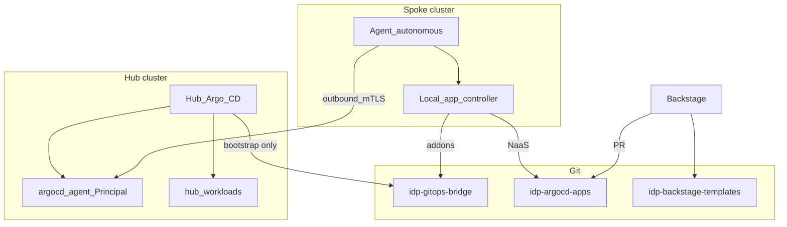
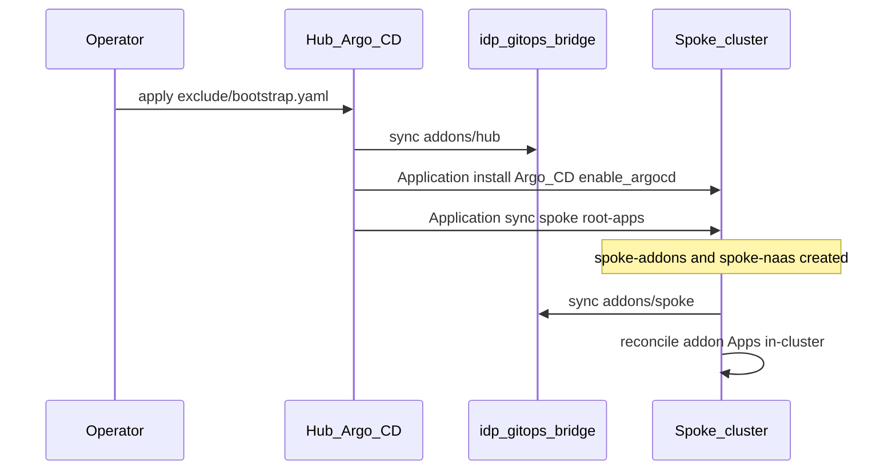
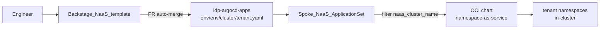
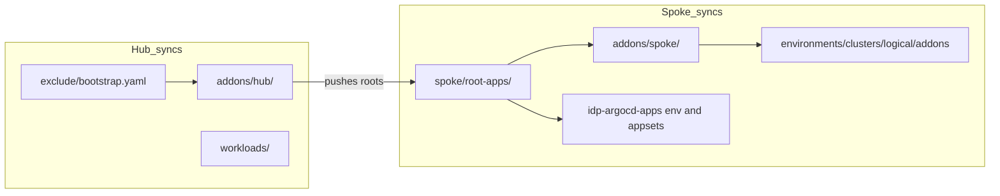
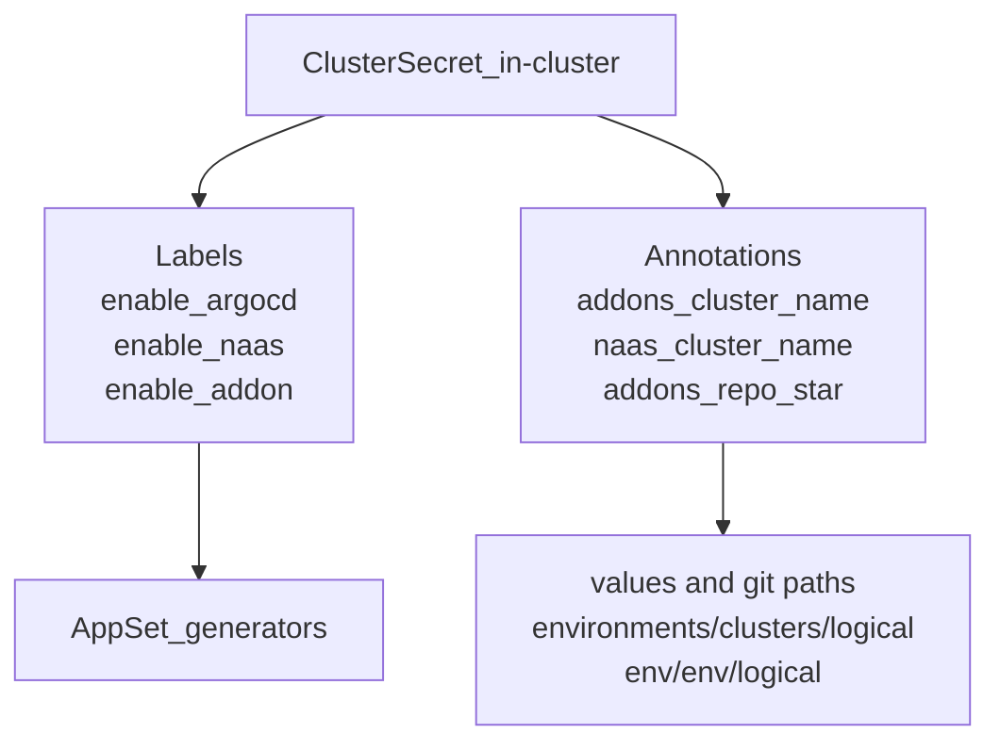

# FILE_NAME: diagrams.md
# DESCRIPTION: Mermaid architecture diagrams for hub–spoke GitOps
# VERSION: 1.0.0
# AUTHORS: ravichandrapatel

# Architecture diagrams

Companion to [hub-spoke.md](hub-spoke.md) and [ADR-0001](../adr/0001-hub-spoke-argocd-agents.md).

## 1. Control planes and Git

## 2. Hub bootstrap sequence

## 3. NaaS request path (day-2)

## 4. Repo path ownership

## 5. Secret contract on spoke `in-cluster`

## Rendering

GitHub and most Markdown previews render Mermaid fenced blocks. For local preview, use any Mermaid-compatible viewer or the IDE Mermaid extension.
