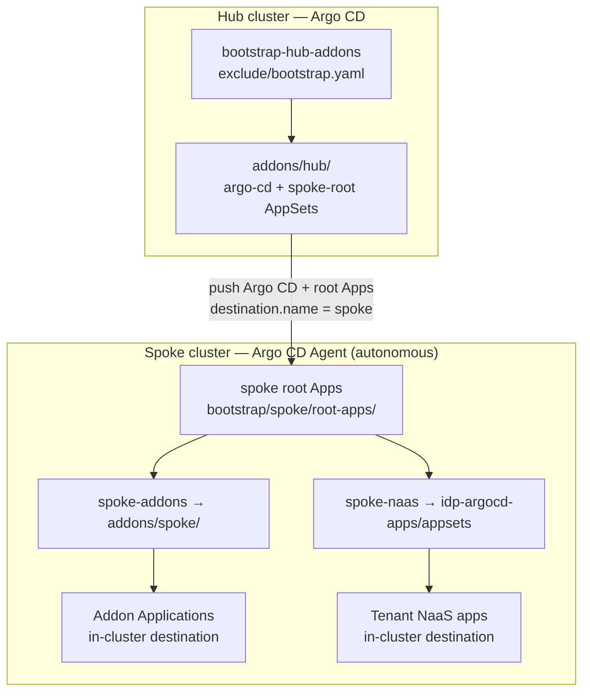

# Hub–spoke Argo CD Agent architecture

## Overview

This control plane uses an **Argo CD hub** plus **spoke Argo CD Agents** in autonomous mode.

- **Hub** installs spoke Argo CD (once) and pushes thin **spoke root Applications** onto registered clusters (`enable_argocd=true`).
- **Spoke agents** reconcile addons and NaaS **in-cluster** (`destination.server: https://kubernetes.default.svc`). Hub does **not** push addon workloads with `destination.name` for those AppSets.

Repos:

| Repo | Role |
| --- | --- |
| [idp-gitops-bridge](https://github.com/ravichandrapatel/idp-gitops-bridge) | Hub bootstrap, hub AppSets, spoke root apps, spoke addon AppSets |
| [idp-argocd-apps](https://github.com/ravichandrapatel/idp-argocd-apps) | NaaS ApplicationSet + `env/<env>/<cluster>/<tenant>.yaml` |

## Mermaid



## Hub path

1. Apply `bootstrap/control-plane/exclude/bootstrap.yaml` on the hub (list generator → in-cluster).
2. Hub syncs `bootstrap/control-plane/addons/hub/`:
   - `addons-argo-cd-appset.yaml` — still uses `destination.name` so hub can install Argo CD on spokes.
   - `addons-spoke-root-appset.yaml` — pushes `bootstrap/spoke/root-apps/*.yaml` into spoke `argocd` namespaces.

Hub workloads under `bootstrap/control-plane/workloads/` remain hub/in-cluster concerns (unchanged pattern).

## Spoke path (autonomous)

Spoke root Applications (created by hub) point at:

- `bootstrap/control-plane/addons/spoke/` — addon ApplicationSets with **in-cluster** destination.
- `idp-argocd-apps` `appsets/` — NaaS ApplicationSet with **in-cluster** destination.

Spoke Argo CD Agent in **autonomous** mode owns sync for those ApplicationSets and Applications. See [Argo CD Agent](https://argo-cd.readthedocs.io/) autonomous / agent documentation for mode semantics.

## NaaS cluster identity

On the spoke, the cluster secret is often named `in-cluster`, not `labs`. Annotate the secret:

```text
enable_naas=true
naas_cluster_name=<path-segment>   # e.g. labs → env/<env>/labs/*.yaml
```

The NaaS git file path uses `*/{{metadata.annotations.naas_cluster_name}}/*.yaml`. If the annotation is missing, the git generator will not match tenant files under the logical cluster name.

## Migration notes

| Before | After |
| --- | --- |
| All AppSets under `addons/oss/` | Hub: `addons/hub/`; spoke: `addons/spoke/`; `oss/` deprecated |
| Bootstrap synced every cluster | Bootstrap list → hub in-cluster only |
| Addon AppSets used `destination.name` | Spoke AppSets use `server: https://kubernetes.default.svc` |
| NaaS AppSet often hub-pushed with `destination.name` | Spoke-local AppSet; in-cluster destination |

1. Deploy hub bootstrap from `exclude/bootstrap.yaml`.
2. Ensure spokes have `enable_argocd=true` and repo annotations for spoke-root.
3. Label/annotate spoke `in-cluster` secret for NaaS (`enable_naas`, `naas_cluster_name`).
4. Remove obsolete hub Applications that previously pushed spoke addon AppSets from `oss/`.
